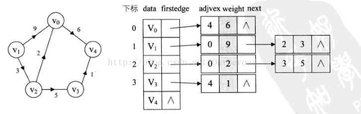
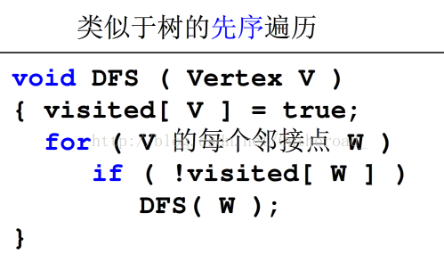
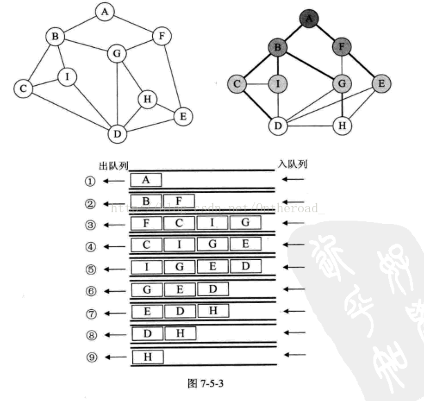
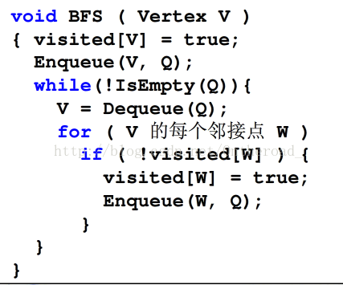
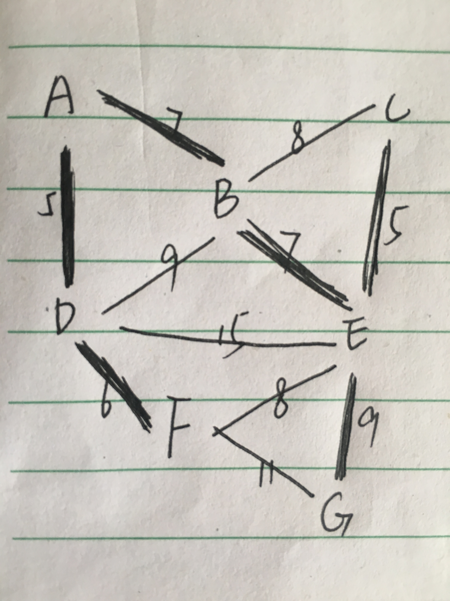
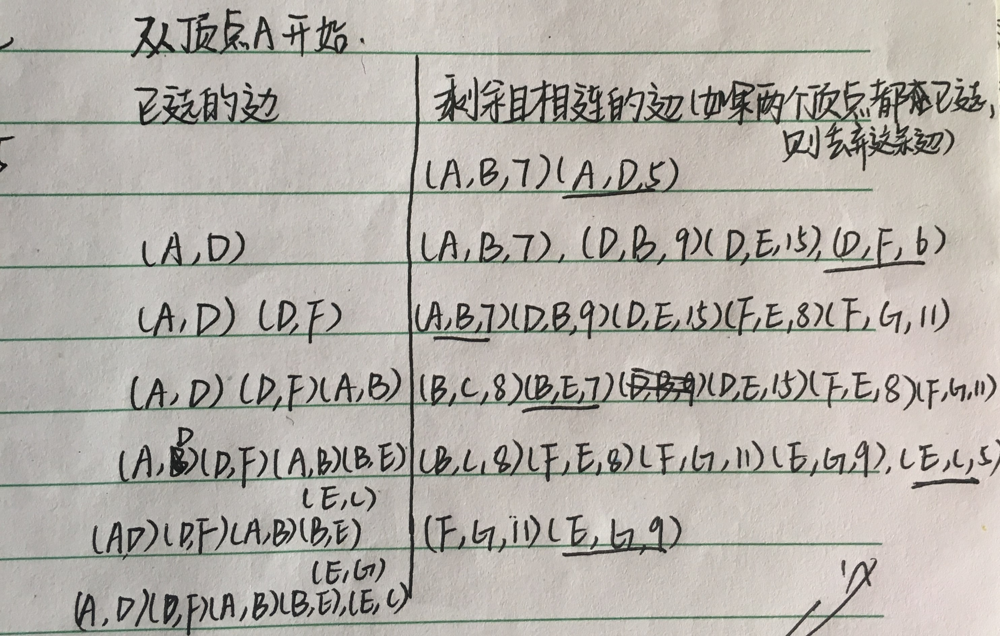
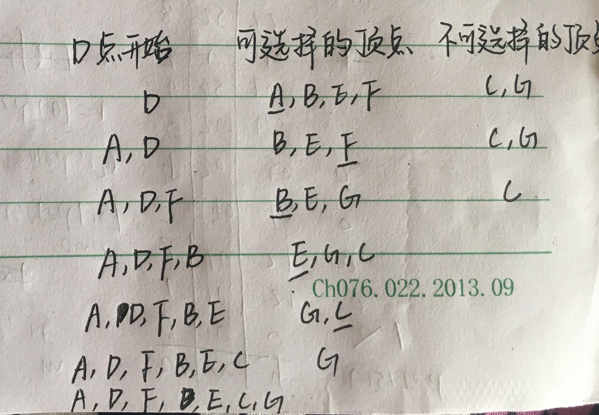
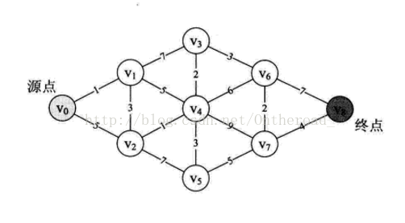

转自[这](http://blog.csdn.net/Ontheroad_/article/details/72739380)

一、基本术语

图（graph）：图是由顶点的有穷非空集合和顶点之间边的集合组成，通常表示为：G(V,E)，其中，G表示一个图，V是图G中的顶点的集合，E是图G中边的集合。

顶点(Vertex)：图中的数据元素。线性表中我们把数据元素叫元素，树中将数据元素叫结点。

边：顶点之间的逻辑关系用边来表示，边集可以是空的。

无向边(Edge)：若顶点V1到V2之间的边没有方向，则称这条边为无向边。

无向图(Undirected graphs)：图中任意两个顶点之间的边都是无向边。（A,D）=（D,A）

```
对于无向图G来说，G1=（V1,{E1}），其中顶点集合V1={A,B,C,D}；边集和E1={（A,B），（B,C），（C,D），（D,A），（A,C）}
```


有向边：若从顶点V1到V2的边有方向，则称这条边为有向边，也称弧(Arc)。用<V1,V2>表示，V1为狐尾(Tail)，V2为弧头(Head)。（V1，V2）≠（V2，V1）。
有向图(Directed graphs)：图中任意两个顶点之间的边都是有向边。

   注意：无向边用“（）”，而有向边用“< >”表示。
简单图：图中不存在顶点到其自身的边，且同一条边不重复出现。

无向完全图：无向图中，任意两个顶点之间都存在边。

有向完全图：有向图中，任意两个顶点之间都存在方向互为相反的两条弧。

稀疏图：有很少条边。

稠密图：有很多条边。

权（Weight）：与图的边或弧相关的数。

网（Network）：带权的图。

子图（Subgraph）：假设G=（V,{E}）和G‘=（V',{E'}），如果V'包含于V且E'包含于E，则称G'为G的子图。

度（Degree）：无向图中，与顶点V相关联的边的数目。有向图中，入度表示指向自己的边的数目，出度表示指向其他边的数目，该顶点的度等于入度与出度的和。

路径的长度：一条路径上边或弧的数量。
连通图：图中任意两个顶点都是连通的。

```
 图1不是连通图，图2是连通图。
```


连通分量：无向图中的极大连通子图。（子图必须是连通的且含有极大顶点数）。图1有两个连通分量
强连通分量：有向图中的极大强连通子图。

生成树：无向图中连通且n个顶点n-1条边叫生成树。

有向树：有向图中一顶点入度为0其余顶点入度为1。

森林：一个有向图由若干棵有向树构成生成森林。


二、图的存储结构

1.邻接矩阵：用两个数组，一个数组保存顶点集，一个数组保存边集。


图的邻接矩阵存储的结构：

[objc] view plain copy

define maxvex 100

typedef struct  
{  
char vexs[maxvex];  
int arc[maxvex][maxvex];  
int vertex,edges;  
}MGraph;  
无向图的创建代码：

[objc] view plain copy

define maxvexs 100

define infinity 65535//用65535来表示∞

typedef struct  
{  

```
char vexs[maxvexs];  
int arc[maxvexs][maxvexs];  
int vertexes,edges;  
```

}mgraph;  

void creatgraph(mgraph *g)  
{  

```
int i,j,k,w;  
printf("输入顶点数和边数:\n");  
scanf("%d,%d",&g->vertexes,&g->edges);  
for(i=0;i<g->vertexes;i++)//读入顶点信息，建立顶点表  
    scanf("%c",&g->vexs[i]);  
for(i=0;i<g->vertexes;i++)  
    for(j=0;j<g->vertexes;j++)  
        g->arc[i][j]=infinity;//初始化邻接矩阵  
for(k=0;k<g->vertexes;k++)//读入edges条边，建立邻接矩阵  
{  
    printf("输入边(Vi,vj)上的下标i，下标j,和权w:\n");  
    scanf("%d%d%d",&i,&j,&w);  
    g->arc[i][j]=w;  
    g->arc[j][i]=w;//无向图，矩阵对称  
}  
```

}  

2.邻接表：数组与链表相结合的存储方法。


对于带权值的网图，可以在边表结点定义中再增加一个weight的数据域，存储权值信息即可。



邻接表结点定义

[objc] view plain copy
typedef struct EdgeNode  
{  

```
int adjvex; //邻接点域，存储该顶点对应的下标  
int weight; //用于存储权值，对于非网图可以不需要  
struct EdgeNode *next;  //链域，指向下一个邻接点  
```

}EdgeNode;//边表结点  

typedef struct VertexNode //顶点表结点  
{  

```
char data; //顶点域，存储顶点信息  
EdgeNode *firstedge; //边表头指针  
```

}VertexNode,AdjList[MAXVEX];  

typedef struct  
{  

```
AdjList adjList;  
int numVertexes,numEdges;//图中当前顶点数和边数  
```

}GraphAdjList;  

三、图的遍历
1.深度优先遍历（DFS）：从图中某个顶点v出发，访问此顶点，然后从v的未被访问的邻接点出发深度优先遍历图，直至图中所有和v有路径相通的顶点都被访问到。



2.广度优先遍历（BFS）：类似于树的层次遍历。






四、最小生成树

最小生成树：构造连通网的最小代价生成树。

1.普里姆（prime）：

第一种：先将一个起点加入最小生成树，之后不断寻找与最小生成树相连的边权最小的边能通向的点，并将其加入最小生成树，直至所有顶点都在最小生成树中。





第二种：
1.将一个图的顶点分为两部分，一部分是最小生成树中的结点（A集合），另一部分是未处理的结点（B集合）。

2.首先选择一个结点，将这个结点加入A中，然后，对集合A中的顶点遍历，找出A中顶点关联的边权值最小的那个（设为v），将此顶点从B中删除，加入集合A中。

3.递归重复步骤2，直到B集合中的结点为空，结束此过程。

4.A集合中的结点就是由Prime算法得到的最小生成树的结点，依照步骤2的结点连接这些顶点，得到的就是这个图的最小生成树。



2.克鲁斯卡尔（kluskal）:在剩下的所有未选取的边中，找最小边，如果和已选取的边构成回路，则放弃，选取次小边。


五、最短路径

1.迪杰斯特拉算法（Dijkstra）：把图中的顶点集合V分成两组，第一组为已求出最短路径的顶点集合S（初始时S中只有源节点，以后每求得一条最短路径，就将它对应的顶点加入到集合S中，直到全部顶点都加入到S中）；第二组是未确定最短路径的顶点集合U。

算法步骤：

```
（1）初始化时，S只含有源节点；
（2）从U中选取一个距离v最小的顶点k加入S中（该选定的距离就是v到k的最短路径长度）；
（3）以k为新考虑的中间点，修改U中各顶点的距离；若从源节点v到顶点u的距离（经过顶点k）比原来距离（不经过顶点k）短，则修改顶点u的距离值，修改后的距离值是顶点k的距离加上k到u的距离；
（4）重复步骤（2）和（3），直到终点在S中。
```




2.弗洛伊德算法（Floyd）：
1，从任意一条单边路径开始。所有两点之间的距离是边的权，如果两点之间没有边相连，则权为无穷大。
2，对于每一对顶点 u 和 v，看看是否存在一个顶点 w 使得从 u 到 w 再到 v 比已知的路径更短。如果是更新它。

