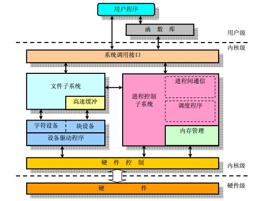

来自[这](https://zhuanlan.zhihu.com/p/26859197)

## Linux 学习路线

这是一幅路线图

不过需要说明的是，第五项驱动开发和第六项嵌入式系统开发是并列的，也就是说，学习完内核之后，你可以选择从事不同的领域，当然嵌入式开发有时会包含驱动开发。

还有就是嵌入式开发包括硬件，软件和系统开发，假如只做硬件的话，你没有必要按照上述路线进行，系统级开发的话，前面的是必备。

**熟悉 Linux 系统，基本命令**

安装 Linux 系统，学会基本操作，熟悉文件系统，shell 脚本以及常用命令。

**了解程序开发过程**

搭建开发环境，了解 Linux 上程序开发过程。

学会使用文本编辑工具 Vim，编译工具 gcc, as, 连接工具 ld, 调试工具 gdb， make 工具，会写 makefile。

用 C 语言实现并编译自己的测试程序。

**尝试系统编程**

试着在 Linux 上用 C 语言进行系统编程，

其中需要调用 Linux 系统库函数 （API）。

例如，实现一个需要进行网络通信、操作文件的多线程/进程程序。

以此深入了解 Linux 系统运行机制。

**学习内核**

上面学的差不多了，感兴趣的同学可以接着学习 Linux 内核。

Linux 内核模块如下图

这一部分内容比较深，能把它学透的基本就是大牛了，写个 OS 就不在话下了。

**驱动开发**

从这里开始，就不是必须的了。

有兴趣的朋友可以深入学习。

但是学习驱动开发无疑要把前面的都要学好。

**嵌入式系统开发**

学好 Linux 是嵌入式系统开发的基础。

嵌入式开发包括很多方向，有硬件、软件，以及系统级别。

硬件要学单片机，ARM、MIPS，DSP 等各种 MCU，Verilog， RTL， 具体就不多说了，跟 Linux 关系不太大。

软件的话，需要了解交叉编译，以及嵌入式环境下 C 语言的特殊用法，例如 volatile、 位操作、寄存器操作、大小端、程序跳转等。

系统级，要了解 Linux 内核裁剪、移植、编译、调试，还有 Bootloader 、设备驱动等。
